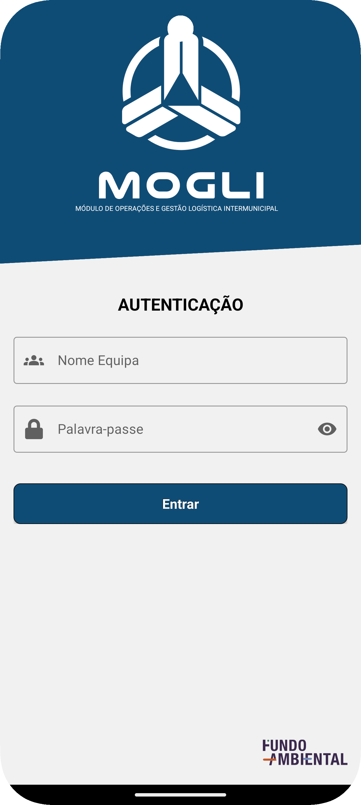
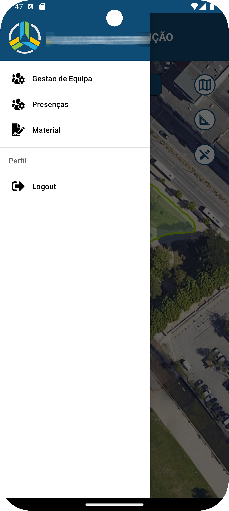
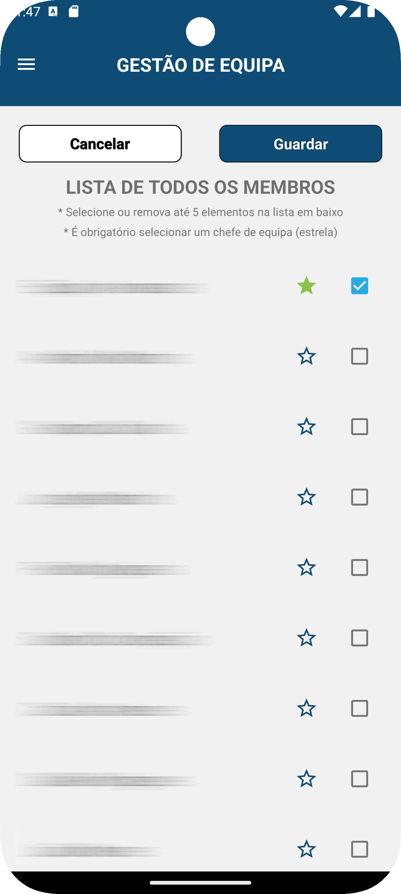
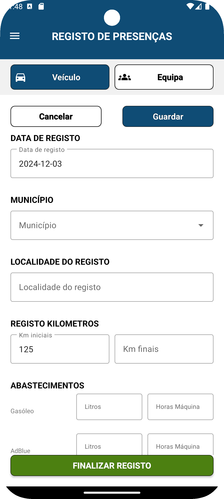

# MOGLI - Modulo de Operações e Gestão Logística Intermunicipal

A aplicação de apoio aos sapadores da zona de Coimbra permite selecionar, organizar e gerir as equipas de sapadores de forma eficiente. A aplicação inclui funcionalidades para iniciar e finalizar trabalhos, registando informações como horas de início e fim, tempo gasto por atividade, quilometragem das viaturas e material utilizado. Também permite enviar notificações para substituição de material quando necessário.

Toda a gestão de equipamentos e utilizadores registados é feita na plataforma SADGE.

<table>
  <tr>
    <td>
      
    </td>
    <td>
      
    </td>
    <td>
      
    </td>
  </tr>
  <tr>
    <td>
      
    </td>
    <td>
      
    </td>
    <td>
      
    </td>
  </tr>
</table>

## Funcionalidades

- Seleção, organização e gestão de equipas
- Registo de horas de início e fim de trabalhos
- Cálculo do tempo gasto por atividade
- Registo da quilometragem das viaturas
- Gestão do material utilizado e notificações para substituição de material

## Tecnologias Utilizadas

- **Linguagem:** Kotlin com arquitetura MVP
- **Layout:** XML
- **Base de Dados:** Room database para offline first app
- **Cliente HTTP:** Retrofit
- **Injeção de Dependências:** Koin

## Contribuições

Este projeto visa melhorar a eficiência e organização dos sapadores da zona de Coimbra, proporcionando uma ferramenta robusta para a gestão diária das suas atividades.

## Licença

Este projeto não contém código fonte devido a restrições de propriedade intelectual da empresa anterior.